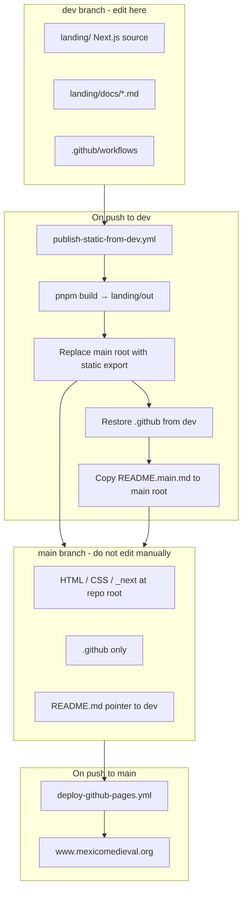

# Deployment and branches

[← Back to documentation hub](README.md)

This page explains how the México Medieval website gets from source code to [www.mexicomedieval.org](https://www.mexicomedieval.org), and which Git branch you should use.

---

## Branch roles

| Branch | Role | Should you edit it? |
|--------|------|---------------------|
| **`dev`** | Source of truth: Next.js app under `landing/`, documentation, data files, and GitHub Actions workflows | **Yes** — all changes go here |
| **`main`** | Published static site at the repository root (HTML, `_next/`, etc.) plus `.github/` copied from `dev` | **No** — updated automatically by CI |

GitHub Pages is configured to deploy from **`main`**. The live site does not run Next.js on a server; it serves the pre-built static export that CI places on `main`.

---

## Deployment diagram

---

## Step by step

### 1. You push to `dev`

When code or content is merged or pushed to **`dev`**, the workflow [`.github/workflows/publish-static-from-dev.yml`](https://github.com/falcando/mexicomedieval/blob/dev/.github/workflows/publish-static-from-dev.yml) runs.

It:

1. Checks out **`dev`** and installs dependencies in `landing/`.
2. Runs **`pnpm run build`**, producing a static export in `landing/out/`.
3. Adds `.nojekyll` and `CNAME` (for the custom domain).
4. Checks out **`main`**, deletes everything at the repo root except `.git`, and copies the build output there.
5. Restores **`.github/`** from `dev` so workflows on `main` keep working.
6. Copies **`static-content/README.main.md`** to the root as **`README.md`** so GitHub shows a clear message on the `main` branch.
7. Commits and pushes to **`main`** (only if something changed).

### 2. `main` is updated → GitHub Pages deploys

A push to **`main`** triggers [`.github/workflows/deploy-github-pages.yml`](https://github.com/falcando/mexicomedieval/blob/dev/.github/workflows/deploy-github-pages.yml), which uploads the repo root (excluding `.git` and `.github`) and deploys to GitHub Pages.

The public site at **https://www.mexicomedieval.org** updates after this job finishes (usually within a few minutes).

### 3. Pull requests

Opening a PR against **`dev`** runs [`.github/workflows/ci.yml`](https://github.com/falcando/mexicomedieval/blob/dev/.github/workflows/ci.yml): lint and build in `landing/` to catch errors before merge.

---

## What is preserved on `main`

After each publish, **`main`** contains:

- The static website files (from `landing/out/`)
- **`.github/workflows/`** (from `dev`, so automation continues to work)
- **`README.md`** (short pointer to `dev` — not part of the live site)

Everything else that existed on `dev` at the repo root (including `landing/`, `landing/docs/`, and source data files) is **not** on `main`. That is expected.

---

## FAQ

### I opened `main` on GitHub and only see HTML and `_next`. Where is the source?

That is correct. **`main`** is the built site, not the development tree. Switch to the **`dev`** branch or open [landing/](https://github.com/falcando/mexicomedieval/tree/dev/landing) on `dev`.

### Can I fix a typo on `main`?

**No.** Any commit you make to `main` will be overwritten the next time someone pushes to `dev` and the publish workflow runs. Edit on **`dev`**, push, and wait for CI (or ask a maintainer to re-run **Build static site from dev and push to main** via workflow dispatch).

### Do I need to deploy manually?

**No.** Pushing to **`dev`** is enough for content and code changes to reach production, as long as the GitHub Actions workflows succeed.

### Where is the documentation?

All guides live on **`dev`** under [`landing/docs/`](https://github.com/falcando/mexicomedieval/tree/dev/landing/docs). Start at the [documentation hub](README.md).

### The site didn’t update after my push to `dev`. What should I check?

1. **Actions** tab on GitHub — did `publish-static-from-dev` succeed?
2. Did it produce a new commit on `main`? (Sometimes there are no file changes and it skips the commit.)
3. Did `Deploy GitHub Pages` on `main` succeed after that?

---

## Related guides

- [Documentation hub](README.md)
- [How to update website content](updating-content.md)
- [Local development](local-development.md)
